<!-- Was: Realistic Clouds (future blog?)-->

<!-- [TL;ND]{.tlnd} -->

What better way to get inspired by pulling a 1000-mile-away grass back to one's dwelling for an eternal 24/7 inspiration?
With a camera pointed outside and connected to a local desktop, one could have fun from the constant self-sourced input data to self-trained
models.
Obviously, all these sub-projects will be generated by autoregressive-transformer LLMs (AT-LLMs) to the fullest extent while
also using external libraries in the fullest extent to minimize unit testing and faulty codes. Importantly, there would be some form of
UI-friendly view to the internals of the project to satisfy one's own interest *generated by AT-LLMs* while simulatenously remind one
that all these internals are not the point (and easily automated away.)

# 3D Video

Like a video, but not confined to the input camera's view. Record our world---live---in all its moving parts while also
able to view areas at any angles like a 3D model. Applications could include *anything* really that need
videos to convey space[^hh1] natively to users (just like IRL) or interact videos spatially (just like IRL:)

[^hh1]: Different/novel view is a byproduct towards understanding the space of an object/scene.

* convey:
  * record one's favorite moments in life
  * develop life-like moving digital 3D models for AR glasses (e.g., XREAL One Pro, VITURE Beast) for[^1]
    * a more immersive training (e.g., employee safety) or education (e.g., environmental sciences) to make learning *intuitive* and *impactful*
  * recreating events from camera(s) with spatial prior for investigation purposes (e.g., NTSB videos, bullet trajectories)
* interact:
  * basically, users manipulate 3D videos but reversed---how the pre-arranged environment intended by the users spatially respond to the transient inclusion of the 3D video
    * *refer to the last section of the blog for a close approximation to this idea*

<!-- new way to convey space from a *different perspective* to realize new insights for consumers
  * like *wow!*
 -->

There would inherently be a three-way tradeoffs between realism, number of cameras needed, and
model performance.

[^1]: Notice the for-chains, and its converse by-chains.

## Application 1: Recording favorite moments

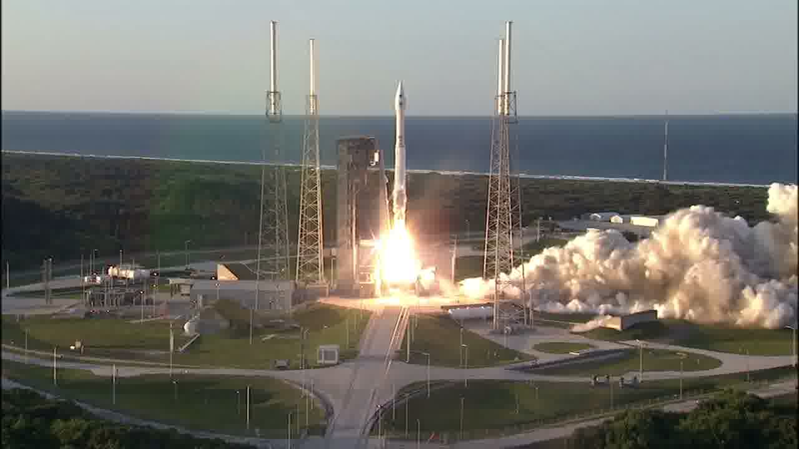

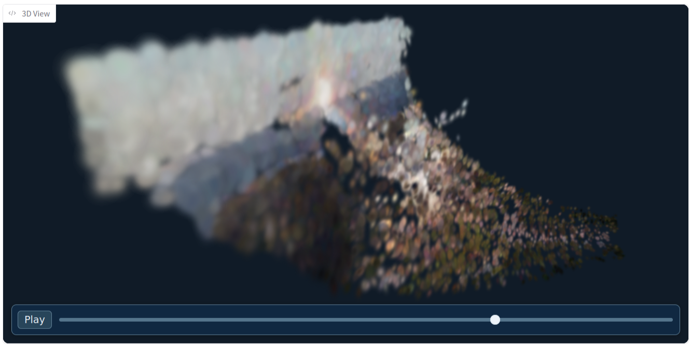

## Application 2: Investigation

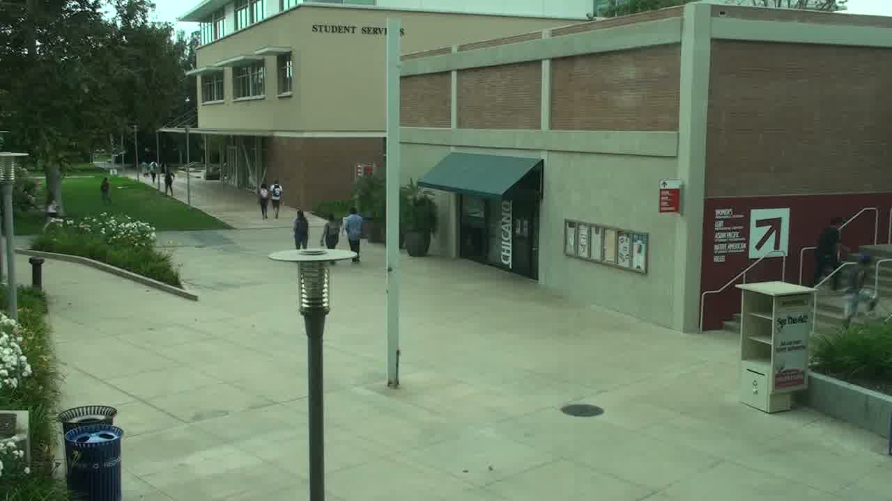

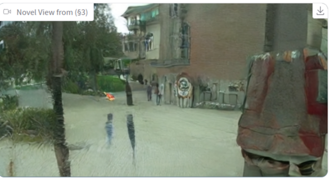

# Predicting Future (single-view)

Given just a single view of the single camera, can historical record be used to predict what the camera
shall see in the future? Would this answer whether people have free will? Or, are people pre-programmed by endless matrices?
Applications could include *any* visually/spatially continuous elements/objects that need visually/spatially continuous predictions
up to a resolution it was historically recorded on:

* forecast structural damage on bridges to reinforce weak points and understand failure cases for safer infrastructure
  * e.g., likelihood of cracks at certain areas of a bridge
* predictive navigation in response to trajectory-altering dynamic (and continuous) environments for robotics for humanoids
to rescue people from flash floods
  * realistically, this either works better with a dynamic (embodied) camera or an external stationary camera(s) such as a drone/satellite flying over the area

This is unlike visual elements of interest (or, spatial objects of interest) that are discrete since they can be assigned with finite---feasible---amount
of sensors for an as effective of a prediction of said elements/objects. These could include applications like traffic modelling/load where discrete sensor-by-sensor prediction is good enough.
However, any discretization is an abstraction of our world. A continuous understanding is needed to wholly understand our world.
Some problems might not require it but many eventually will since, at the center, people always interact a continuous world.
Automated reasoning from visual/spatial feed is the closest continuous approximation that removes as much assumptions as possible (e.g., structural biases from sensor configurations)
while still remaining in the widely-available discrete, digital platform.

<!-- * optimal navigation in response to trajectory-altering dynamic environments for robotics for humanoids rescuing people
in a building fire that has parts collapsing
*
 -->

## Application 1: Forecast structural damages

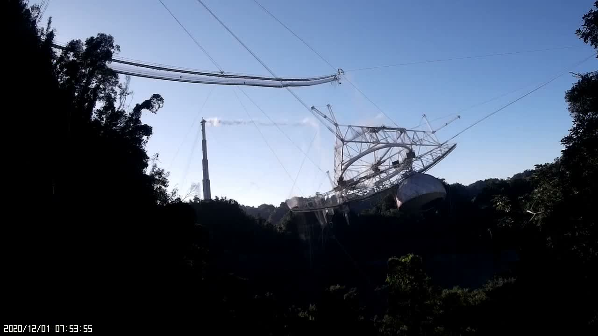

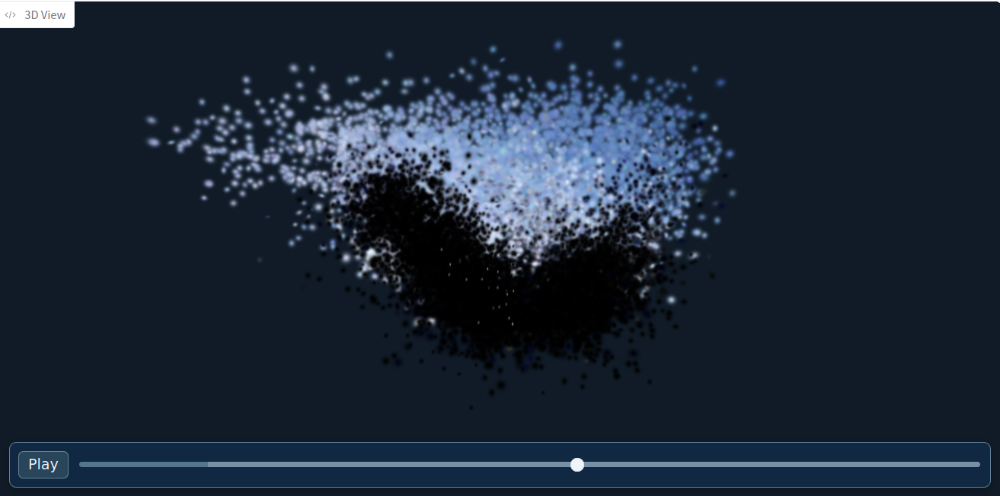

## Application 2: Predictive navigation

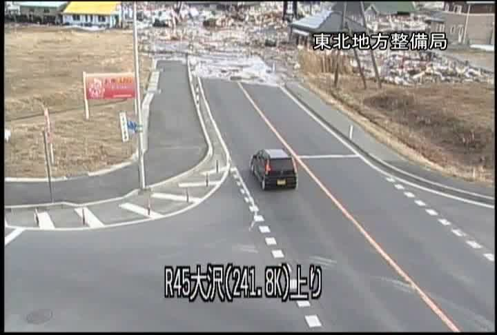

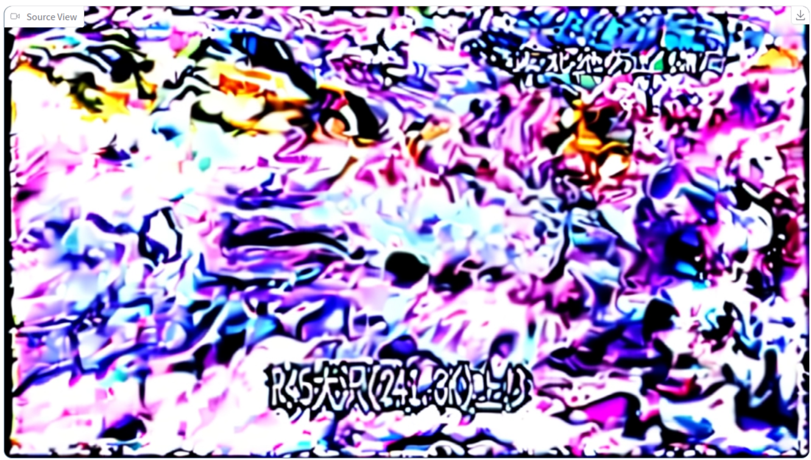

# Text Query in Mass Video Record

A super long video of, say, five years non-stop needs to be searched through. How would anyone know *where* and/or *when* to look for
when 99% of the video is not what they're interested in? What if it was a 500 of them that's part of a larger archive?
Applications could include *any* requests in text that requires [visual/spatial]-temporal understanding to quickly, accurately,
and precisely obtain time period(s) and (3D) segmented region(s) of (3D) video(s) for a more intuitive search:

<!-- spatial request in text-quary, visual request in text-query, textual request in text-query -->

<!-- Applications: -->

* quick, automated retrieval of region(s)-of-interest in the video of few shops across the street on when and where
flood levels raises above three feet to decide weather severity and whether additional people need to be evacuated.
* identify areas where the source of water is coming from via water (and/or mold) stains and the structure
of the room and rest of the building

A lot of what people see and interact with the continuous world could easily be solved visually.
When either the camera view(s) are dynamic or have multiple cameras can spatial understanding be more useful.

<!-- However, a better applications
for spatial understanding is what we cannot see visually such as blueprints. This remains to be explored
in the future.
 -->

<!-- a large object occludes the view of the ATM and suspects enter the occluded region that is occluding the ATM
for theft detection
 -->

## Application 1: Automated weather alerts

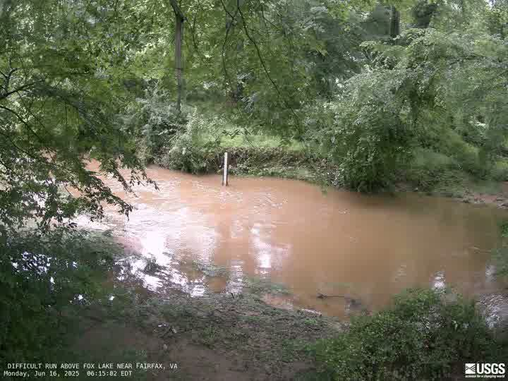

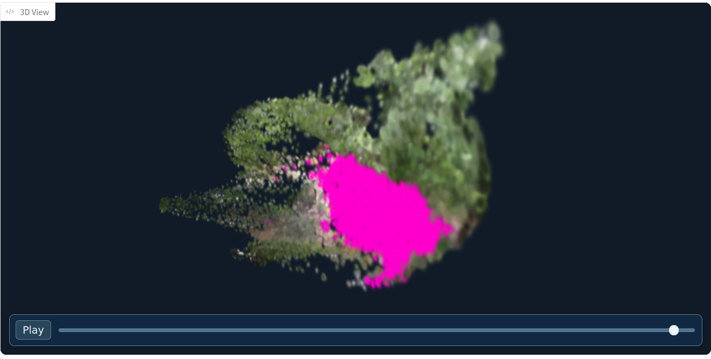

## Application 2: Water source identification

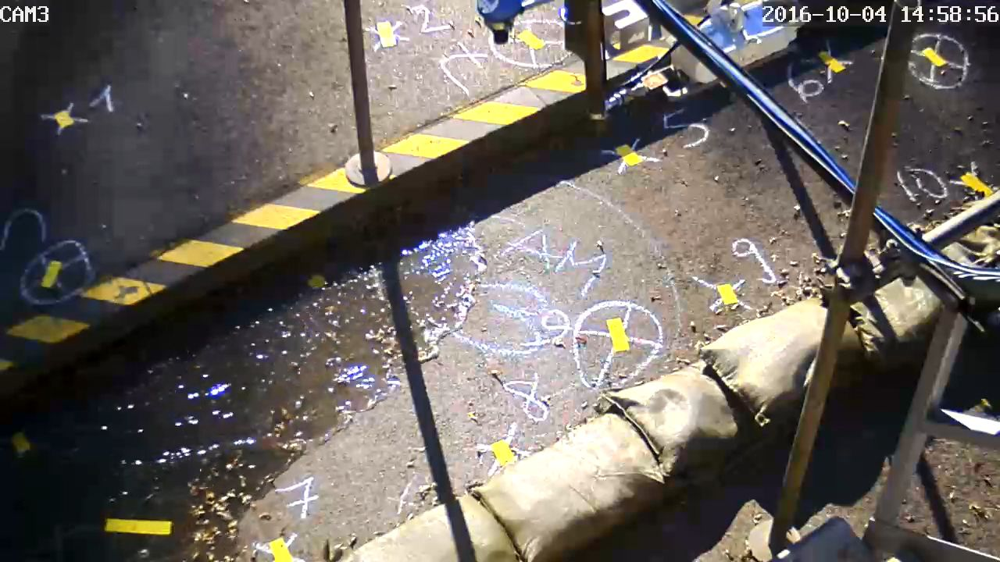

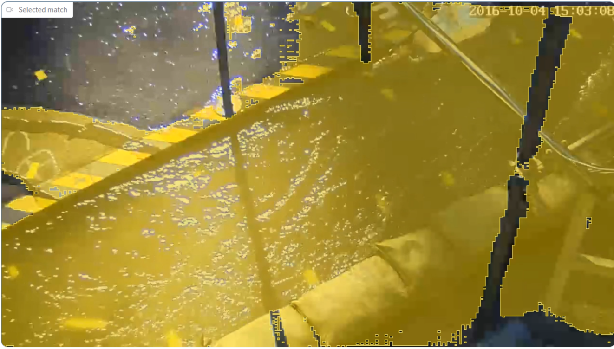

<!-- Reverse simulation??? -->

# Text Manipulation of Video Record

Applications:

* request the wind to move in the opposite direction so the trees sways on the opposite direction
and the weather vane flips direction to satisfy user intent within the constraint of reality
* replace the window vanes with horizontal blinder while keeping all other properties the same
for a dynamic interior design (e.g., what-ifs) where such invariant properties could include:
  * direction of the sunlight at different times and season
  * color of the sunlight
  * indoor lighting placement and its Kelvin temperature
  * sound emission (e.g., microwaves, dishwasher)
* ideate an architectural design of a vacant parcel that satisfy historically-recorded weather conditions

<!-- engineering constraints, building codes, and energy efficiency standards -->

## Application 1: Spatial Editing

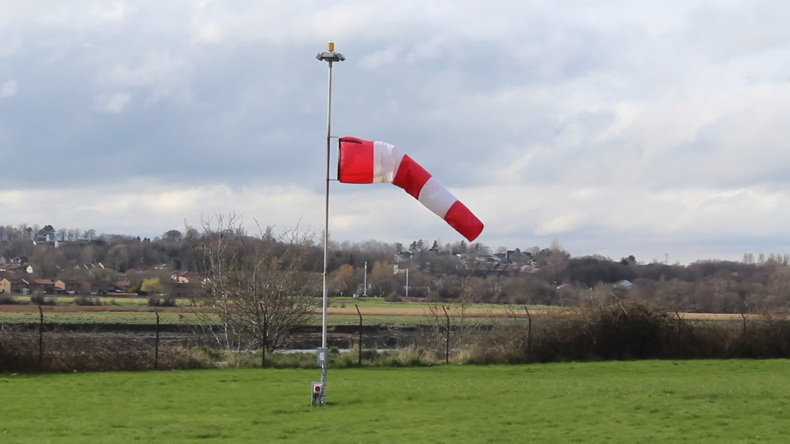

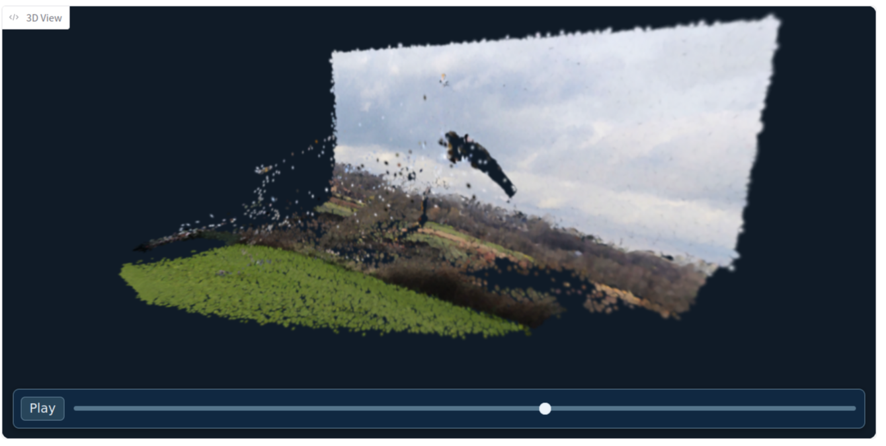

## Application 2: Interior Design

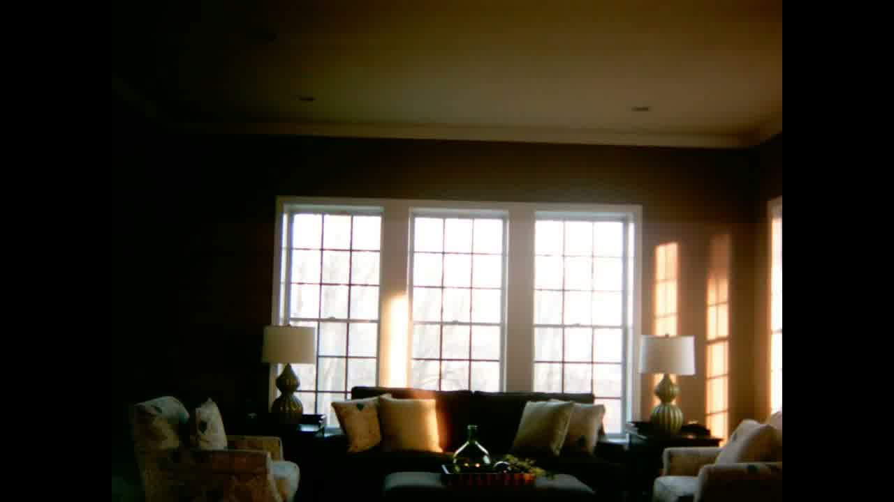

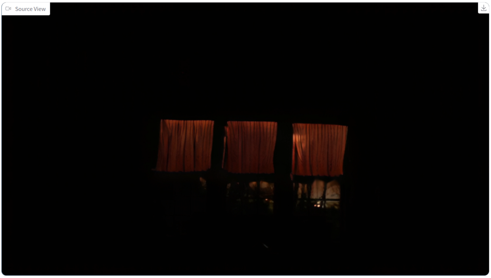

<!-- What better way to get inspired by pulling the 1000 miles away place back to the dwelling 24/7? At least this would
give one a reason to manage a server now.

Even though it's a single-view video stream, it would be interesting what project can be thought from it.

Constantly trained.
 -->

<!-- # Preliminaries -->

# Summary

Due to limited time, not much of the methodologies can be explored yet. However, the vision for these methods, the applications,
are there and hopefully gives a starting point to optimize the specifics with theory and apply these visions to reality.

# Project Codebase

GH: [v0.1.0](https://github.com/andrew-shc/evow/releases/tag/v0.1.0)

