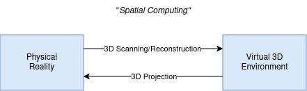

<!-- [TL;ND]{.tlnd} -->

3D is perhaps the most powerful framework any algorithms, models, or systems can employ.
In some sense, the idea of it is general enough to make connections with many important subjects
and fields, but also the world we live, breathe, sense, and experience in is also three-dimension---something
fundamental that even the SOTA model in different areas still lack
(e.g., autoregressive-transformer LLMs) or struggle (e.g., inverse rendering).

# Problems Beyond

Forward rendering, reconstruction, and other classical problems still have a lot of work to be done.
However, the end goal has always been enriching our experience of this world. Some problems are clear
about this. For example, better rendering to appease our thirst for certain appearance such as
realism (e.g., PBR materials and path tracing) or the retro computer era of the 80s (e.g., surface-stable fractal dithering).
Yet, other problems such as reconstruction are rather unclear about it. In this case, let's say we reconstructed a scene with all
of its lighting, materials, and geometry... cool. Now what? Satisfy your own curiosity---sure. But if
anyone wants it anytime soon, it has to go through other problems also: Re-*render* the reconstructed scene after it has been
spatially manipulated for training humanoid robotics to better navigate around the house or re-*simulate* the reconstructed
scene to infer consequences of current actions (or the lack thereof) to guide infrastructural decisions that reduces
risks of flooding.

> What do people want? What do businesses want? (What do interviewers want?) What do we all want?

For extensive existing work in "spatial computing" to expand into exciting new domains beyond 2030s, it first has to go beyond
a simple 2D screen. Sure, LLMs brings a huge wild card and questions the need to go beyond an intelligent-like chatbot
that could answer your spatial questions and alike, but that really misses the point of 3D and not using its fullest potential.
In the times where greater amount of our attention is spent on backlit screen or just flat screens in general,
I think consumers (you, me, and others) would appreciate something a bit different, something more immersive.

<!-- Making a good use of 3D requires the ability of the the user

Due to lack of time, current problems that are actively being solved in-practice will not be covered.

## Emerging Problems
 -->
<!-- personal sentiment, investor sentiment, company investment, long or short?, current hype cycle -->
<!--
5-40 year future speculation

VC funding rounds
Unicorns
Seed
Defense/government contracts
Nvidia customer list
journals own outlooks
space
SIGGRAPH papers

Telepresence

R&D, Products, Government (?)

if only there's a way to bring the captured 3D information back into reality...

reconstruction for architecture... surgery...
3D for capturing, what about output? telepresence???? (no viable 3D display)

we are limited by what we can output... screen and 3D printing is the only way so far...
-->

# Future Work

Robotics, AR, and other active forms of immersive interaction of the physical space will be looked into.
Commonly overlooked problems where "spatial computing" methods can be shown to
immensely help or solve will also be discussed. Additionally, current state of industry and where are people heading into
in regards to "spatial computing" will also be looked into. This line of thought will be shelved
for now as other important works take precedence.

