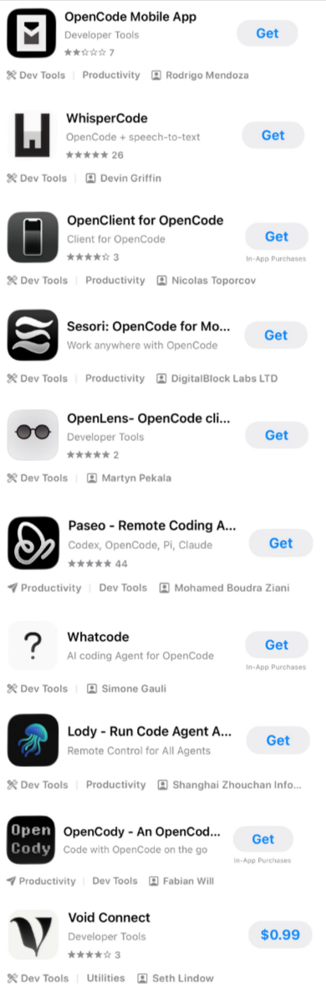

<!-- [TL;ND]{.tlnd} -->

This is an immediate follow-up from the previous note [here](./120.qmd).

Problems restated:

* Unnecessarily high token usage / session limit reached often
  * Cost-friendly models
  * Use SDD-like intent-driven development (use markdown files as a natural language annotation for context management)
* Awkward wait time between response or requests
  * Commonly resolved by relaxing permissions and setting up notification systems
* Multi-project management
  * More repositories and different contexts requires better overall management (e.g., dashboard?)
  * AI-driven task management (e.g., AI Kanban board?, AI Notion-like interface?)
  * Not necessarily multiple agents working on a single project (i.e., multi-agent development / swarm or whatever)
* Granularity and transparency
  * Extensive usage of git (e.g., worktrees, diffs, PRs)
  * Easy access to the working accrued context
* Inter-agent context passing
  * How easy can I transfer the context from Claude Code to Opencode (e.g., `CLAUDE.md`/`AGENTS.md`, `.claude/*`/`.agents/*`, etc.)

> Workflow is not meant to be static, but rather a dynamic process that occasionally need its own write-up, a written snapshot or a moment,
to intentionally be more aware of all the changes happening around us before crawling back under a rock again.

# Core Decisions

Opencode's offering against its cost is too good to pass, but we hope to incorporate some ideas of Aider's transparency and
Zcode's mobile control. We'll look into Opencode's Go plan on top of Claude Code.

# Additional Features

A lot of them just needs a lot of trial and error in practice that are hard to document right now, but we can start documenting
what features/tools that will hopefully be useful or be aware with.

::: {.callout-note}

# Note

In hindsight, a lot of the idea presented here seems to be re-thinking how coding agents
are used. Instead of treating it as a black-box workflow and prompt it with "fix this error goddam it,"
we should be explicit in what we reference, the environment we work in, and other details toward the models.
Less frustration with high-expectation and more emphasis on orchestration/management with the details of builds and coding automated.

:::

*Claude Code /// OpenCode*

* Visualize context/usage
  * `/context` /// ~
  * `/usage` /// `$opencode stats`
* Explicit object reference
  * Files `@./file` /// `@./file` (same)
  * Directories `@./dir/` /// `@./dir/` (same)
  * MCP: `@server:resource` /// ~ (implicit / natural language only)
  * bash commands `!...` /// `!...` (same)
* Permissions & modes
  * Modes: `[Shift+Tab]` between default and plan (read-only) mode (and other modes) /// `[Tab]` between build and plan (read-only) mode
<!--   * Modes: never used it and likely will never use it (follows black-box/implicit principle) -->
<!--     * Auto: `--dangerously-skip-permissions` or `--permission-mode bypassPermissions` /// [`--auto`](https://opencode.ai/docs/permissions/#auto-mode) -->
  * Instead, use whitelist with emphasis on globs
    * [`.claude/settings.json['permissions']`](https://code.claude.com/docs/en/permission-modes) /// [`opencode.json['permissions']`](https://opencode.ai/docs/permissions)
* Session resumption
  * By most current: `claude -c` /// `opencode -c`
  * By selection: `/resume` /// ""
  * By id: `$claude --resume <id>`, `/resume <id>` /// ~
* Session fork
  * Good for side-tracked ideas. Although, we would rarely use it if we follow the principle of
  minimizing context to at most 50% of its stated window limit and frequently make new session for
  new topics.
  * `/branch` /// `/fork` (allows forking at any point in history)
  * ignore `/fork`, `/rewind` /// ~
* Transparent/explicit inter-session context management
  * Disable auto-memory
  * Don't use compaction `/compact` /// `/compact` (maybe equally bad?)
    * In practice, it is awful because it let's the agent decide what to keep or not (i.e., implicit management).
    Always better to "self-compact" via distilling session knowledge to markdowns as needed.
  * `CLAUDE.md` /// `CLAUDE.md` (supports it as fallback)
  * `./.claude/rules` /// some instruction fields in `opencode.json` (not per-path conditional?)
* Session isolation via git worktrees
  * No complex worktrees needed. Both have (`/diff` /// "") to easily, independently verify the changes, which
  common IDE extension do not have. `!git commit` after also!
  * *Future work*
<!--   * 1. `claude -w <name>` (into `.claude/worktrees/<name>/`) /// ``
  * 2. `git diff main..worktree-<name>` /// ""
  * 3. `git merge worktree-<name>` /// ""
 -->
* Remote control
  * Claude Code: `/rc` works like magic (just make sure your focus mode allows Claude if you're on iOS)
  * OpenCode:
    * (on the server with Tailscale) `opencode web --hostname 0.0.0.0`
    * Opencode CLI (Ubuntu): `opencode attach http://localhost:4096`
    * Whispercode (iOS): select the option to connect via the tailscale IP address
* Skills
  * *Future work*
* Subagents
  * *Future work*
* Code intelligence
  * *Future work*
* Other (for awareness and not really useful at the moment)
  * Hooks, MCP itself, Plugins themselves, Agent teams (under preview?), Tools (superseded?) /// Custom tools, etc...

## Multi-project Management (Manual Orchestration)

[Vibe Kanban](https://github.com/BloopAI/vibe-kanban) seems cool, but the need for it isn't really there for
small simple codebase (e.g., research codes) and managing few projects simulatenously. There are Claude Squad, Nimbalyst,
Claude Command Center, amux, CCManager, etc. [Paseo](https://github.com/getpaseo/paseo) end up being the right balance
between large community base, remote control, and, importantly, Claude Code and OpenCode support. In fact,
it seems to largely supersedes `/rc` and Whispercode. It's always good to plan like this before actually applying
the workflow and finding this out months later.

At the end of the day, we all likely use various coding agents and even orchestrators, rendering a lot of agent-specific
features (e.g., subagents, skills, etc.) inaccessible or hard to unify. In other words, pointless to know these agent-specific
features. But what is uniform is the ability to write high-level intent-driven markdown files and explicitly request the agent
to read them, regardless of model, harness, orchestrator, platform, etc.

::: {.callout-note}

# Special Note

Paseo has an option to use Claude Code directly via their terminal emulator, which is useful to bypass
Anthropics new separate monthly credit system for programmatic usage instead of their interactive usage.
However, it seems like they reverted it same-day, so it should be fine to use their models within Paseo
(instead of the terminal emulator) to get the same benefit as the interactive Claude Code while
also allowing notifications. Paseo's terminal notification seems unstable for now despite enabling their
hooks option.

*Just like my broken Ubuntu environment, Paseo still doesn't notify me on agent completion/request
when I focus on another app on iOS, or sometimes notify me when I focus on another app on laptop, or,
for some reason, reliably notifies me when I close my phone AND close my laptop.*

:::

<!-- # Comparisons -->

# Future Work

There isn't really much to talk about it. Since Paseo was only recently created and its popularity
skyrocketed, it'll be interesting to do a follow up in this aspect. But looking at Paseo right now,
it seems pretty good (despite lacking CLI/TUI) and I don't see myself changing workflow again for at least
through the next year??

Takeaway: Paseo, use markdowns for natural-language intent-driven development, and frequently fork/clear session.

