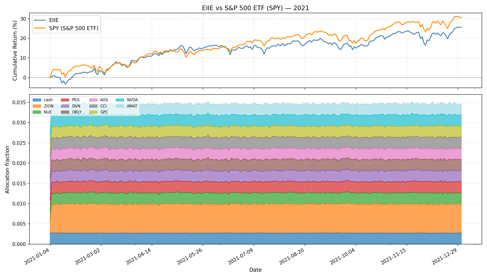
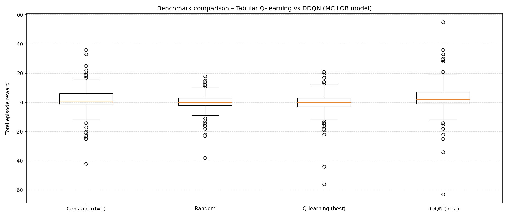
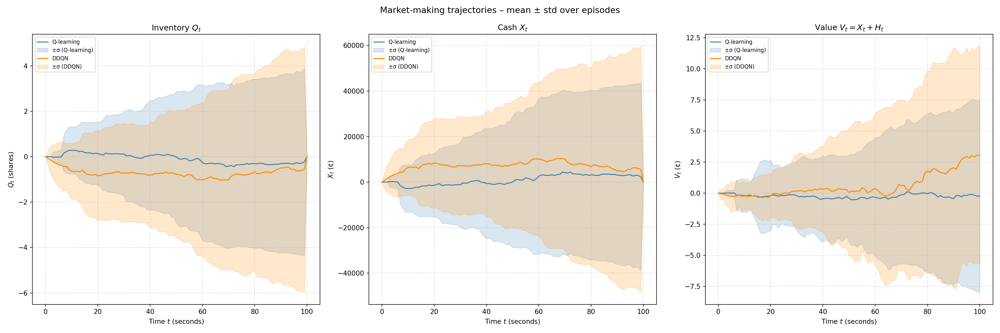
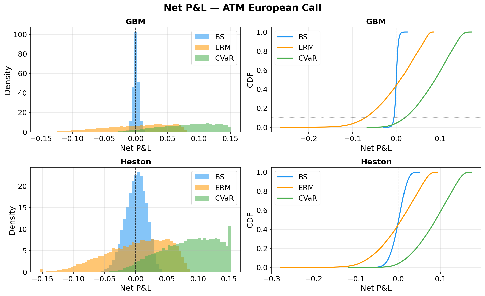
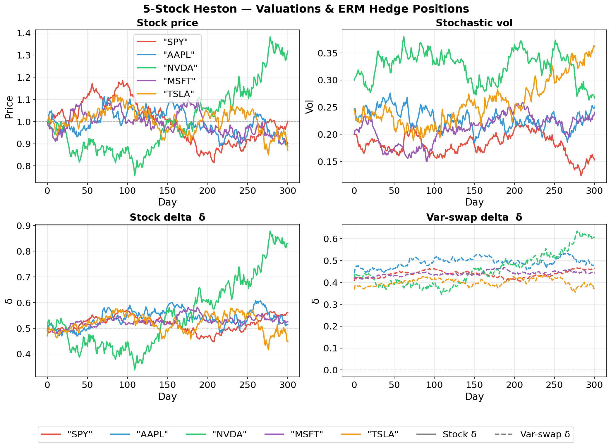

<!-- [TL;ND]{.tlnd} -->

Two topics that seems intriguing in the context of RL:

* Autotelic AI
* Trading

# Autotelic Intelligence

When people say AI, I would imagine some artificial computers that not only *act* like human but also *think* like human---a one-to-one correspondence of biological intelligence and artificial intelligence. When I ask people what kind of AI they're talking about? Before 2023: It goes something like XGBoost, LSTMs, or DNNs! Like come on they're just fancy, albeit powerful, statistical modelling on tabular data. After 2023: autoregression on transformers and diffusion. At least they *act* quite like humans? Current (hype?) cycle: world models, which actually makes environmental consideration first-class. However, you still have to *prompt* the model. A true AI should exhibit the ability to interact the world *unprompted* (e.g., intrinsic curiosity) with occasional *prompting* (e.g., teachers setting curriculum) through time. Through this, we not only get the benefit of an artificial computer that can self-initiate, but a system that eventually *thinks* like human---hopefully. In other words, **biomimicry without mortality**.

Maybe the idea of autotelicity and self-initiation seems more like engineering: Just insert an infinite `while` loop at the end of the model to continuously, *un*conditionally prompt the model to achieve similar effect. Yet, maybe its more complicated then that. Regardless, I would not have discovered the word "autotelic" if it were not for existing research that have been working on this---lately. And they work on the AI aspect, not just in psychology, where I think it best fits in RL.

...

Ok this is me after a week of being busy on other stuff and I realized there's just too much stuff to explore in this world and currently automated trading is piquing my interest.

# Trading

> If money is evil, then that building is hell. This is the most obnoxious group of money-hungry, low-IQ, high-energy, jack-rabbit, fucking wannabe big-time, small-time, shit-talking, bothersome, irritating bunch of motherfuckers I have ever had to endure for more than five minutes.
>
> — Robert Downey Jr., *The Last Party* (1993)

I held a long belief that supervised and unsupervised ML models can never predict the utter unpredictability in both the traditional and predictions market because of the rigidity in their training and inference pipeline. Now, I want to test that belief with the following two questions:

* Is my intuition wrong that supervised and unsupervised ML models are inferior? If so, what's the point of RL?
* Regardless, what's the current research showing RL can (potentially) succeed existing model paradigms in markets?

First question can be briefly answered by @sun2021reinforcementlearningquantitativetrading. According to them, there are some RL methods
that yields high returns, but many aspects of quantative trading tasks has yet to be fully developed from RL (e.g., lack of consistent
evaluation metrics, lack of infrastructure, etc.) or even explored yet. All of this is implicitly compared against supervised methods,
so, yes, my intuition is mostly wrong. In fact, my thought is that RL can dynamically explore the states and constantly learn or
"self-trains" on new out-of-distribution data (similiar idea to autotelic AI). While I don't think most RL methods "self-train"
(i.e., self-optimizes on newly explored data), they actually do exhibit the same o.o.d. problem like supervised methods.
Nevertheless, the point of RL, briefly mentioned in @sun2021reinforcementlearningquantitativetrading, is (i) end-to-end pipeline,
(ii) can safely be optimized over price directly, (iii) task-specific constraints easily modelled as objectives, and (iv) generalize to
any market condition. Although there's a lack of theoretical/empirical grounding in these reasoning, it at least sufficiently answer the question
initially and motivate us to further look into this subject.

This brings us to our second question.

## Overview

Key idea from [Hambly (2023)](https://arxiv.org/abs/2112.04553) is most RL methods developed for finance
assumes a lot, and for it to be practical in the first place, one must relax many of these assumptions
(e.g., stationarity). With further browsing from [Pippas (2025)](https://arxiv.org/pdf/2408.10932) and [Bai (2024)](https://arxiv.org/pdf/2411.12746),
portfolio management, options (e.g., derivatives), and market-making has the right balance of intrigue and proximity to applications (i.e., profitable end-to-end systems).
Despite the infamous [*The Bitter Lesson*](http://www.incompleteideas.net/IncIdeas/BitterLesson.html) that says we need general learners, we also have this blog [*Cool Kids Keep*](https://www.argmin.net/p/cool-kids-keep)
saying the opposite (at least in RL).

Apparently, RL is related to optimal control which is used in various engineering fields. In our case,
it would be stochastic optimal control for trading. While it doesn't sound as sexy as RL, there could
be some concepts that can be borrowed to aid in the development of this area. The application of RL
is also more general that could include automatic ways to seek alpha and online learning, unlike optimal control's
more narrow usage for things like risk minimization (albeit in a more transparent, interpretable, and accessible way.)

## Portfolio Management
*Similiar to portfolio optimization/allocation, asset allocation, etc.*

Let us consider a portfolio based on S&P 500. Suppose $\mathbf{w}_t$ is a normalized vector of weights for
each $m$ assets at time $t$ and $\mathbf{y}_t$ as the price for each asset (at time $t$).

We will investigate two model-free RL approach: [EIIE (2017)](https://arxiv.org/pdf/1706.10059) and [SARL (2020)](https://arxiv.org/pdf/2002.05780).
Both uses (deterministic) policy gradient method where we optimize via $\nabla_\theta J(\xi)$ where $\xi \sim \pi_\theta$
such that $\pi_\theta:\mathcal{S}\to\mathcal{A}$ and $J:=R$. $J$ is our loss defined as the reward $R$
of the trajectory $\xi$ based on the optimized policy $\pi_\theta$ represented as function approximators
(i.e., neural networks like CNN, LSTM, etc.) with parameters $\theta$.

In the EIIE approach, their states $\mathcal{S}$ are the asset weights with price history and actions
$\mathcal{A}$ as the *new* future asset weights that the policy wants to later re-allocate towards to.
SARL has an embedder to represent external sources (e.g., news) as states $\mathcal{S}$ in hopes to
better inform the model with similiar $\mathcal{A}$ as before. Both consider some form of overhead costs $\beta_t$
(e.g., transaction fees, commissions) in their returns, which is modelled as some aggregation of
individual rewards for each $t$ where each rewards $\beta_t(\mathbf{w}_t\cdot\mathbf{y}_t)$ are
the total value of the portfolio at $t$. While both methods have their own unique, novel contributions,
we will mostly focus on the understanding of their overall RL framework.

Note: For the figure, we will only be comparing EIIE and SPY ETF since the provided SARL model has its encoder only
trained on DJIA.

While the graph does feel reminiscent of supervised DL, supervised DL, after further investigation, seems to require significant feature engineering
and pipelining (if we want end-to-end decision-making model). Pipelining can introduce good inductive/structural bias per
the no free lunch theorem, but the way it does so can be messy and error-prone. RL models the end-to-end process
naturally without the structural bias[^1] and we still can
incrementally introduce regularization that is both mathematically elegant and a system that's more workable.
Additionally, EIIE introduces Online Stochastic Batch Learning (OSBL) from Online RL, emphasizing RL readily
supports real-time learning from theory that could be important in trading/markets[^2].
Overall, it'll be interesting to see how POMDP and non-stationarity by on-policy can be included in existing RL models for trading in hopes of exceeding
existing algorithm's performance---especially when tabular data are inherently easier to work with overall compared to 2D data (e.g., images) or 3D data (e.g., meshes).

Side note: Some argue a better RL needs a better simulation. If we try to simulate the market dynamics,
then we kind of want back in a full circle. What most people are likely talking about is improving
current state of market simulation that current lacks many basic elements (e.g., transaction costs).

[^1]: However, it does replace some assumptions from supervised DL with its own.
[^2]: Online RL has already demonstrated its use in real-time robotics, overlapping control theory.

Based on [TradeMaster](github.com/TradeMaster-NTU/TradeMaster) (functionally active up to ~3 years ago)

## Market Making
*Similiar to high-frequency trading, quote optimization, inventory management, etc.*

<!-- Just like any differentiable function is approximately locally linear when zooming in, zooming in on market dynamics -->
<!-- (i.e., market microstructure) becomes approximately locally stationary (even with other competitive agents). -->

As we focus on the market microstructure, we can no longer assume the repeatibility of the environment as the market at this level
responds much more dynamically. Simulation becomes more important (e.g., transaction cost, limit-order books, order flows, order precedence). This is where RL seems to really shine considering it generalizes the environment
which can easily incorporate dynamic (non-stationary) transitions while also natively supporting the notion of actions (i.e., decision-making process)
for end-to-end modelling. Also latency, in-practice, is very important, which we will side-step for now. Deep models are
getting faster on dedicated GPUs to an extent that RL and other deep models can soon or even be actively deployed right now.

We will specifically look into two model-free value-based RL: tabular Q-learning and double deep Q-learning (DDQN). Importantly, the training is
simulated in a Markov Chain (MC) based LOB environment (most exchanges in-practice uses the LOB model to manage unfilled orders).
Both Q-learning and DDQN here are based on temporal difference (TD) to optimize the values and augmented with $\epsilon$-greedy (i.e., random exploration).
Both of their action space $\mathcal{A}$ is defined as $\mathcal{A}:=\mathcal{D}=\{1,\cdots,\overline{d}\}^2$
where they represent how deep their LO (on both sides) should be placed *relatively* to the opposing best price (i.e., higher value
means more profit from larger spread but less chance of executing from the incoming MOs). Both rewards are similiar:
$R_t=\Delta V_t$ where $V_t=X_t+H_t$ is the total value process as the sum of cash process $X_t$ and the holding process $H_t$
(the value of all the LOs if liquidated). For DDQN, it is additionally regularized with $-\phi Q_t^2$
to account for risk management (i.e., less inventory $Q_t$ means less risk from adverse market trends with unrealized LOs).
The realization process from matching order flows are implicitly done by the simulation (i.e., the conversion of some inventories
$Q_t$ into cash $X_t$). The state space for tabular Q-learning is $\mathcal{S}:=\tilde{\mathcal{T}}\times\tilde{\mathcal{Q}}$,
where both the time and inventory increments are binned to reduce spaces, whereas
DDQN's support for larger spaces allow modelling the full observable states of the environment
$\mathcal{S}:=\mathcal{T}\times\mathcal{Q}\times\mathcal{L}$. The time and inventory increments are unbinned with an additional
current LOB state $\mathcal{L}$ which records the volume at each increment relative to the asking/bidding price with the spread $s(t)$.

No inventory regularization was applied for DDQN. Despite DDQN being on average (i.e., the expectation) better, it is also more volatile. This is where sharpe ratio
comes in oftenly and why risk management is important since each trajectory represents individual forecast on how well the model will do.
If even one negative trajectory shows up, the model would be risky to run since it would have a chance to follow that negative trajectory.
This does not even factor in the difference between the results evaluated in-simulation and performance of the model in-reality.

Based on [RL for MM from Carlsson's MS Thesis](https://github.com/KodAgge/Reinforcement-Learning-for-Market-Making) (functionally active up to ~3 years ago)

## Options Hedging

*Similiar to options/derivatives pricing, deriviatives hedging, etc.*

We will assume our action $\mathcal{A}$ space to be $\Delta_t$, which is a $d$-dimensional $\delta_t := (\delta_t^i)_{i=1,\cdots,d}$
for how much units (e.g., ratio of 100 shares) we want to hold for each $i$th asset at time $t$. Our state space $\mathcal{S}$ would be $\Delta_{t-1}\times H$
where $(S^i_t)\in H$ is the history of the underlying valuation for each $i$th asset
up to $t$. Think $H$ as like a big matrix between the number of assets ($d$) we can use to hedge against our
short option(s) $Z$ and all the previous time increments/ticks ($t$). Our policy $\pi$ is simply a mapping from the state space
to the action space, which is implemented as a semi-RNN over time where we use different weights
across time for a pre-specified total time period [^zz1].

Specifying the individual reward $R_t$ at each timestep is commonly done in RL; however, we only
define our individual rewards as the overall return $R$ as it seems to be commonly done so in financial modelling.

$$
R(\theta)=-\rho(\text{PL}_T(Z,p_0,\delta^\theta))
$$

Definitions:

* $\rho$ is some abstract risk measure function. Riskier an asset, the higher the measure will be. Hence, we want to maximize the "safety" $-\rho$.
Entropic risk measure (ERM) will be used: $\rho(\cdot):=\frac{1}{\lambda}\log\mathbb{E}[\exp{(-\lambda(\cdot))}]$.
  * Alternatively, $\alpha$-CVaR (conditional/average value at risk) is also used, where $\rho(\cdot):=\frac{1}{1-\alpha}\int_{0}^{1-\alpha}\text{VaR}_\gamma(\cdot)d\gamma$.
The integrand VaR (value at risk) outputs the smallest value $m$ when the chance of the input asset (a R.V.) being below $-m$ reaches $\gamma$.
In other words, $m$ is the risk in terms of price (i.e., when the input asset's value goes below $-m$ (loss) at a probability of $\gamma$).
* $\text{PL}_T$ is the agent's terminal ($t=T$) portfolio value after full liquidation. The portfolio is the range of $d$ assets used to hedge against the liability and the liability itself (the option of interest).
* $Z=\sum Z_i$ is the risky asset/portfolio. In our case, it's our portfolio of options $Z_i$ for each underlying stock $S^i$ (which can be synthetic or real).
* $p_0$ is the indifferent price of $Z$ (i.e., how much initial money it takes to buy the portfolio $Z$ such that its risk is same as not buying in anything).
  * More commonly known as the minimum premium of the options we are willing to sell/short our options $Z_i$ (derived from $S^i$)
* $\delta^\theta$ is the history of weights used to decide which asset(s) to allocate more to hedge against $Z$. This is predicted
by the semi-RNN parameterized by $\theta$.

If we have $\delta^i$ [^zz2] to be all $1.0$ and the corresponding stock value $S^i$ goes up to make
the OTM option $Z$ to be ITM, then the buyer is likely to exercise (i.e., the seller gets assigned) and
we, the seller, profit off of the initial uncertainty (the volatility) from a positive premium (since the shares
we bought earlier raised in equal value to be re-sold to the buyer). However,
if the ITM option $Z$ becomes OTM as $S^i$ goes down, then the buyer will not exercise and we are left
with 100 shares of *devalued* $S^i$: This can be thought of as the hedge risk. If we reverse and
have $\delta^i$ to be all $0.0$ when $Z$ goes from ITM to OTM, we save the hedging risk and 100% profit
off of the premium (the buyer has 0 reason to exercise the call). But if the option $Z$ goes from OTM to ITM,
the buyer will exercise and we have to buy the share high and sell it low to the buyer per the options contract:
This can be thought of as the assignment risk. Since we never know whether an option will stay (ITM to ITM, OTM to OTM) or flip (ITM to OTM, OTM to ITM)
or to what degree, per the direction of the underlying stock, we always have to dynamically balance out the hedging risk and the assigment risk.
This is where deep learning or deep RL comes in to find the optimal mapping from the current environment to the optimal
weights trajectory $\delta^i_t$ (and maybe try to profit a bit also).

Using policy gradient (PG) method from RL, we don't need to know the individual reward at each timestep
nor their $Q$ or $V$ values: We compute $\nabla J(\theta)$ where $J(\theta):=R(\theta)$. In this way, we will find the
optimal policy $\pi^{*}$ (implemented as the semi-RNN) that best hedge against our portfolio of options given the available assets/stocks,
which would find the optimal delta trajectory $\delta_t$ to minimize risk (i.e., maximize "guarantees").

The weight allocation changes a lot (aggressive rebalancing) since we set the cost low. If the cost
to change hands is high, the weights trajectory should be smoother. Although CVaR seems to have
better P&L distribution (more profit than losing), it sets the base premium price higher (i.e., the indifferent price)
that makes it less competitive (i.e., less likely to be executed). Hence, the simulation
is also incomplete (i.e., need to incorporate multiple agents).

::: {.callout-note collapse="true"}
### (Simulated) Stochastic Model for Market Dynamics (GBM & Heston)

### Geometric Brownian Motion (GBM)

$$
dS_t=\mu S_t dt + \sigma S_t dW_t
$$

If we remove the $dW_t$ term in this SDE, the rest is just ODE. $dW_t$ is the Brownian motion (Wiener process)
that governs the randomness. It is from a general subject called stochastic calculus (specifically, Ito integral)
that requires further reading. In our case, we assume risk-neutral modelling so $\mu=0$.

Properties:

* Constant drift $\mu$ and constant volatility $\sigma$ (unrealistic)
* Memoryless (hence, geometric)
* Options pricing (for European calls/puts) is the well known Black-Scholes formula
* ... many others

### Heston

$$
\begin{align*}
dS_t &= \mu S_t dt + \sqrt{V_t}S_t dB_t \\
dV_t &= \alpha(b-V_t)dt + \sigma \sqrt{V_t} dW_t
\end{align*}
$$

Also $\mu=0$ for risk-neutral simmulation.

For Heston model, each stock has two assets usable for hedging (instead of each stock having one asset in the case of GBM.)

While the volatility $V_t$ is not tradable directly, we can wrap it as *options on variance* via "idealized variance swap with maturity $T$".

$$
S_t^{'} = \mathbb{E}\bigg[\int_0^T V_s ds \bigg| \mathcal{F}^H_t \bigg]
$$

So if we have 2 stocks, we have $(S^{1}, S^{1'}, S^{2}, S^{2'})$ each with its own delta weight $\delta^i$ trajectories
which the deep hedger optimizes.

:::

[^zz1]: Most options have a pre-specified time periods that are usually in months or weeks.
[^zz2]: Precisely $\delta^{i,\theta}$ but omit $\theta$ when it's not needed for clarity.

Based on [PFHedge](https://github.com/pfnet-research/pfhedge) which is based on [Deep Hedge (2018)](https://arxiv.org/pdf/1802.03042).

## Code
All custom basic training and visualization code are in this [repo](https://github.com/andrew-shc/3frl).

